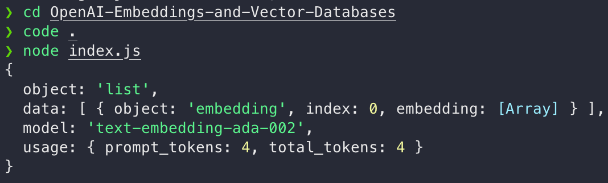

# OpenAI-Embeddings-and-Vector-Databases
Embeddings and Vectors are a great way of storing and retrieving information for use with AI services. OpenAI provides a great embedding API to do this. 

The createEmbedding function sends a POST request to the OpenAI API with a specified input text, in this case, 'Hello, world!'. The response, if successful, is logged to the console and includes details about the generated text embedding, the model used, and usage statistics. The code provides a basic example of how to integrate OpenAI's text embedding functionality into a JavaScript application.
