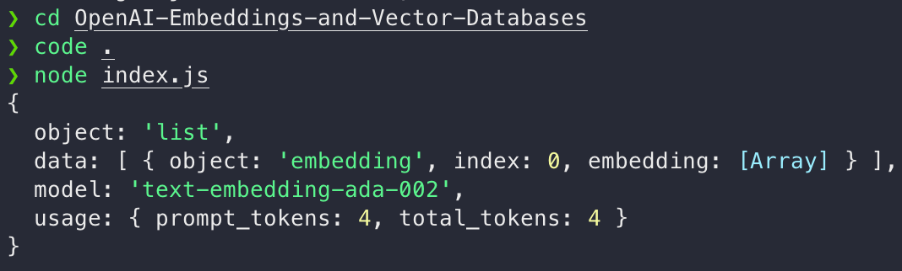
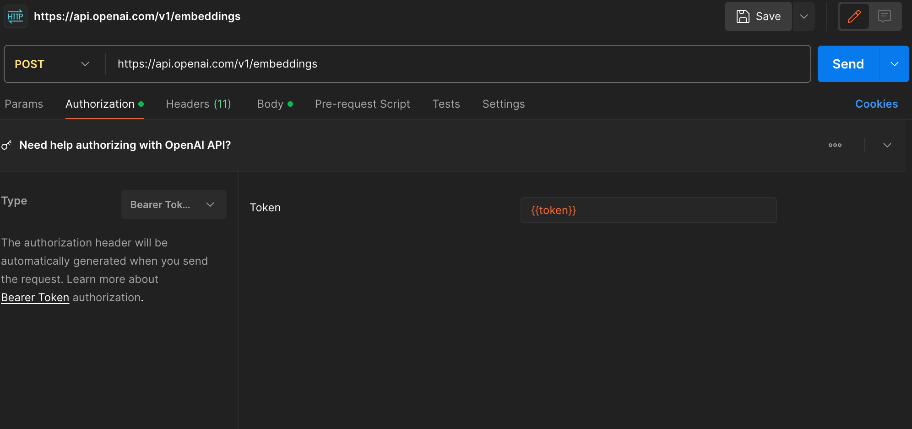
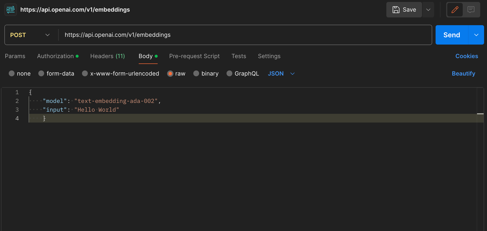
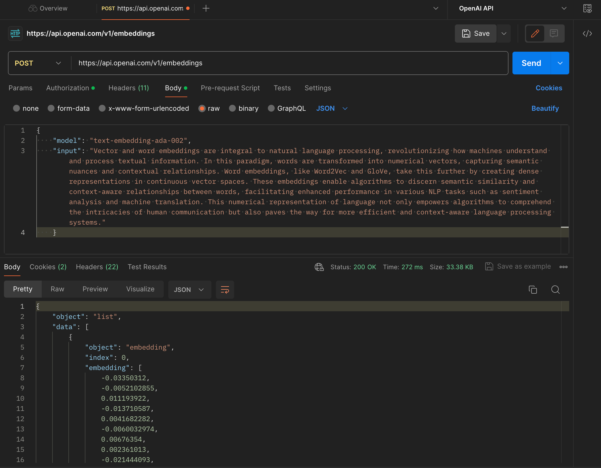
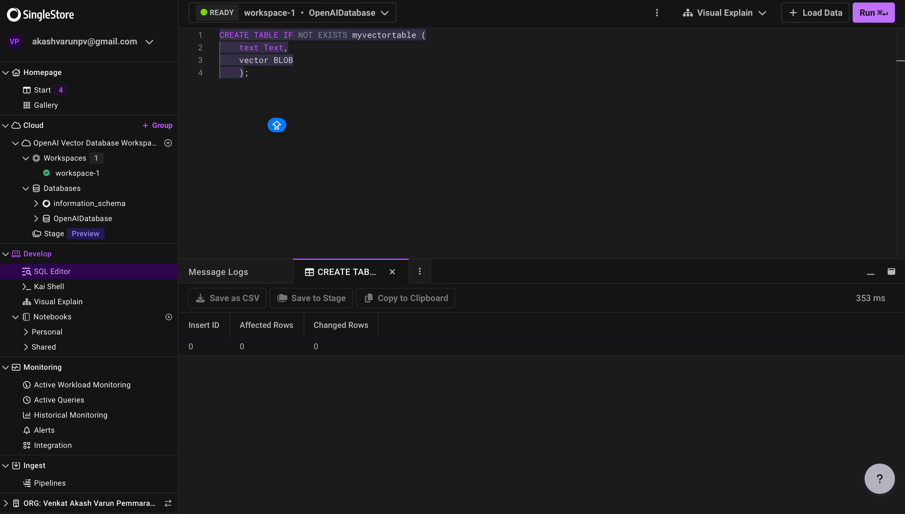
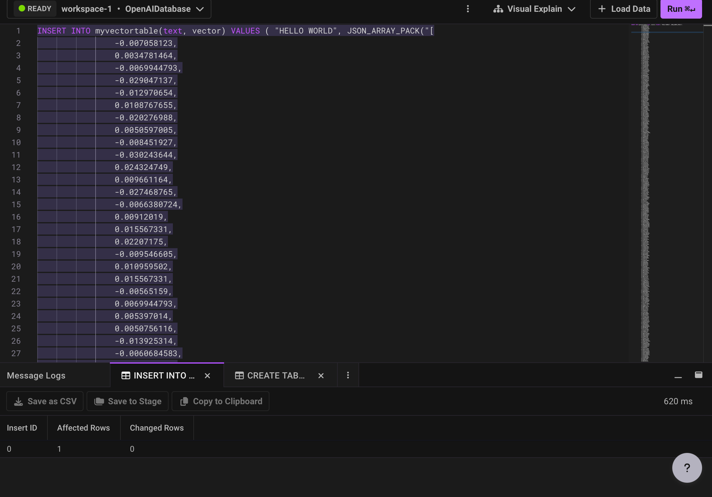
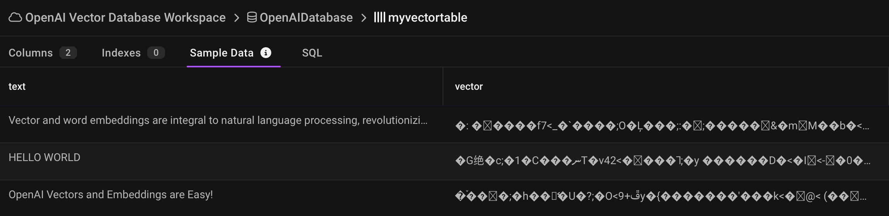
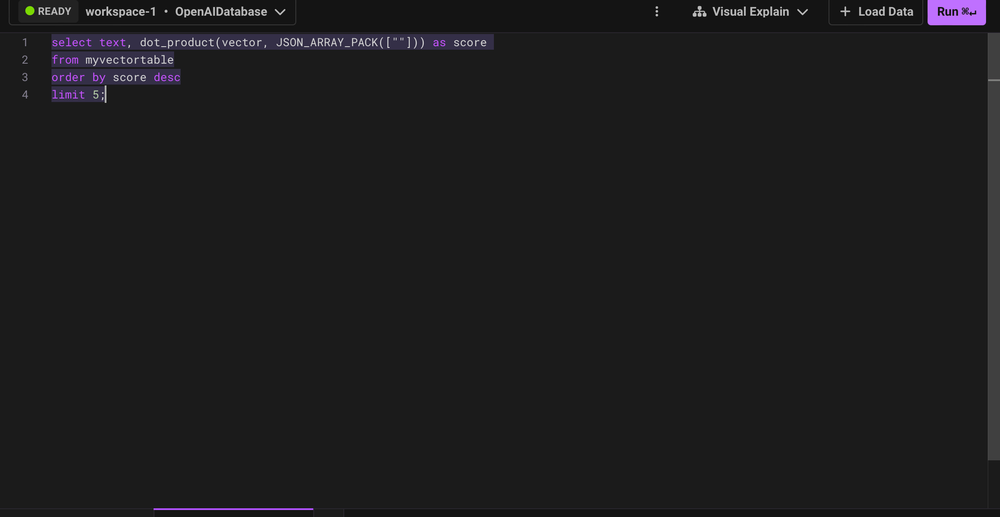
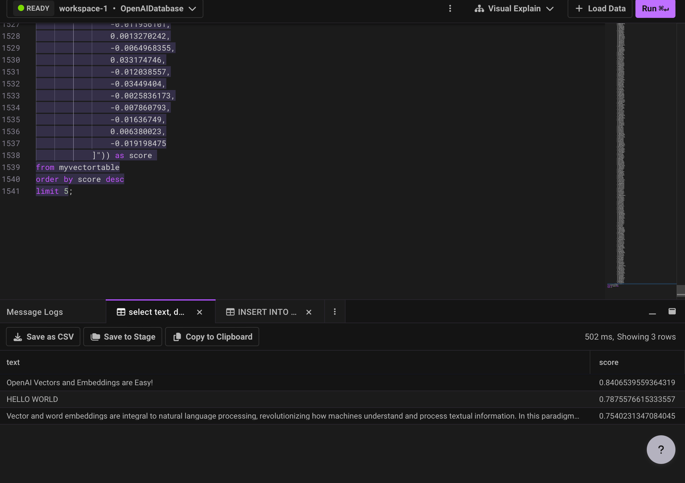
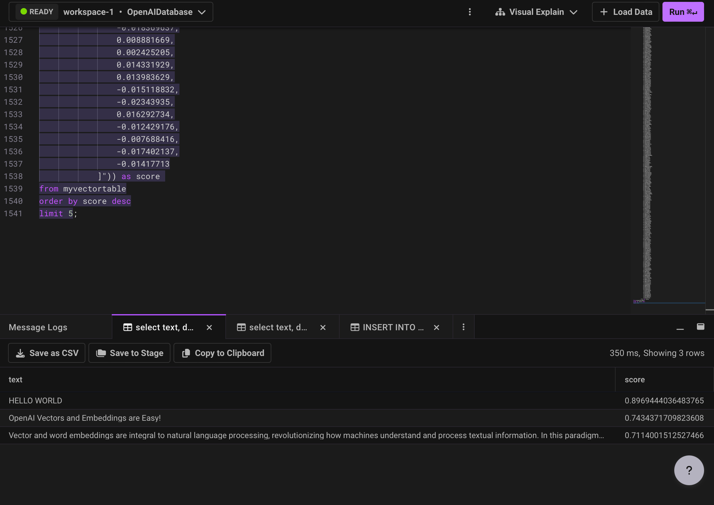

# OpenAI-Embeddings-and-Vector-Databases
Embeddings and Vectors are a great way of storing and retrieving information for use with AI services. OpenAI provides a great embedding API to do this. 

The createEmbedding function sends a POST request to the OpenAI API with a specified input text, in this case, 'Hello, world!'. The response, if successful, is logged to the console and includes details about the generated text embedding, the model used, and usage statistics. The code provides a basic example of how to integrate OpenAI's text embedding functionality into a JavaScript application.

## Testing Using Postman Tool down below :

##### The Response for this testing in postman is saved as response.json in this repo.

### Embedding Generation For Large Para

#### The Database full of embeddings are different these are called Vector Databases

Here I have Tried with SingleStoreDB which is cloud DB.. Now i will try to store the embeddings in the DB and Try to Search them.

After Setting a Workspace and DB in SingleStoreDB ... 

##### Creating the Table 

##### Inserting the Data in DB

##### In a similar way I have generated other embeddings using postman, Now viewing our Sample Data 

### DB Query to find the similar word in vectors

#### Results of Searching OpenAI & Hello Earth....

First I created the embeddings for each word and then pasted the embedding in the above query 

#### In the Both Above and below screenshots .. You can find the score of similarity to the bottom right corner 

